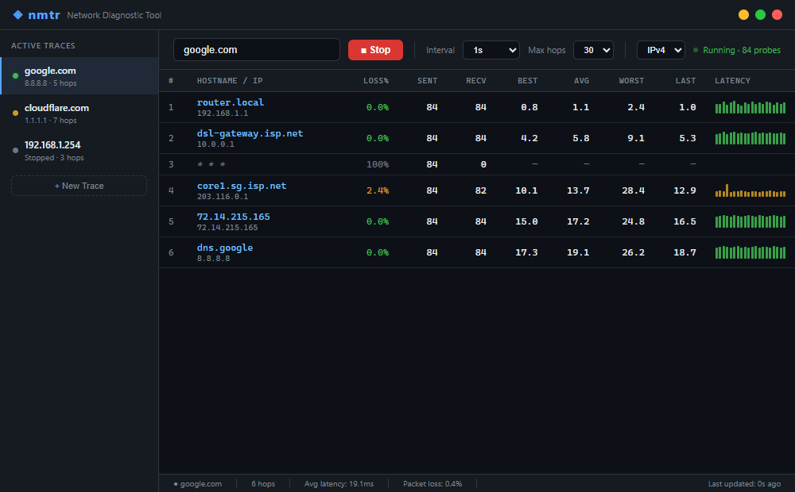

# {NMTR} — Network Diagnostic Tool

A modern rewrite of WinMTR as an Electron desktop application for Windows. Combines continuous traceroute and real-time ping into a live dashboard with per-hop statistics, geolocation, session recording, and trace history.



## Features

- **Parallel ICMP engine** — calls `IcmpSendEcho` from `Iphlpapi.dll` directly via `koffi` FFI, all TTLs probed in parallel with no concurrency cap, kernel-measured RTT; falls back to `ping.exe` subprocess if the ICMP API cannot be loaded
- **Per-hop statistics** — Loss%, Sent, Recv, Last / Avg / Best / Worst (ms), Jitter, 60-point rolling sparkline
- **RTT heartbeat chart** — live chart above the hop table tracking final-hop RTT over the session (up to 300 samples), color-coded by latency
- **Bottleneck highlight** — automatically marks the hop with the largest RTT increase (≥10 ms delta) with `▶` and a yellow row tint
- **Route change detection** — detects mid-session IP changes per hop, marks with `▲`, logs events in the Route Events panel
- **Geo world map** — fully offline SVG map (bundled TopoJSON, zero network requests) with markers for every geo-located hop and hover tooltips
- **Network path graph** — interactive node graph of the hop topology
- **Trace history** — completed sessions are automatically saved and viewable in the History tab; updates live when a trace stops
- **Session recording / playback** — save traces to `.nmtr` files and replay at adjustable speed with a scrubber
- **Export** — Text (WinMTR-compatible), CSV, HTML; text copies directly to clipboard
- **Latency detail** — click any hop row to open a full RTT/loss chart (60-point sparkline with avg reference line, live-updating every 1 s) plus stat panel
- **WHOIS lookup** — right-click any hop → View WHOIS
- **Multi-tab traces** — run parallel traces to multiple targets simultaneously
- **System tray** — minimize to tray, context menu shows active sessions
- **Auto-updater** — GitHub Releases integration via `electron-updater`
- **Keyboard shortcuts** — `Ctrl+Enter` start/stop, `Ctrl+R` reset, `Ctrl+E` export, `Ctrl+,` settings
- **True IPv6 support** — full end-to-end IPv6 tracing, including protocol selection, engine, UI toggle, rerun, and export
- **Pause/resume live traces** — pause and resume active traces without losing session state
- **History filter/sort/rerun** — filter and sort trace history, rerun any previous session with one click
- **SLO alerting** — configurable alert thresholds for packet loss, RTT, and jitter; live alert stack (bottom right), desktop notifications, and alert history
- **SSL scan** — SSL Labs–style TLS audit: resolve a host to its IP endpoints, pick one, then probe every protocol version (SSLv3→TLS 1.3) and enumerate supported cipher suites, inspect the certificate + chain, verify trust and hostname, flag weak/insecure ciphers and protocols, and compute an A+→F grade; scan history with delete, rescan, and diff-vs-previous. Pure-Node `tls` engine — works offline and against internal IPs, no data leaves the machine
  - **Multi-IP scan** — scan every resolved endpoint at once and compare them side by side, flagging endpoints whose grade, enabled protocols, or certificate diverge (catches load-balanced nodes with drifted configs)
  - **OCSP revocation** — parses the OCSP response stapled during the handshake; a confirmed revocation drops the grade to `T` and raises a critical issue
  - **HSTS & security headers** — a single dependency-free HTTPS request reads `Strict-Transport-Security`, `Content-Security-Policy`, `X-Frame-Options`, and `X-Content-Type-Options`; HSTS gates the jump from A to A+ and missing headers surface as issues
  - **Expiry watchlist** — star any endpoint to watch it; the watchlist sorts soonest-to-expire first with color-coded days remaining, auto-refreshes on every scan, and offers one-click re-check
- **Public Scan** — ImmuniWeb-style web security test: enter a public domain/URL and get one orchestrated, *passive* assessment with an A+→F grade plus per-category sub-grades. Checks HTTP security headers (HSTS/CSP/X-Frame-Options/…), cookie flags (Secure/HttpOnly/SameSite), CSP weaknesses (unsafe-inline/eval/wildcards), TLS posture (trust, hostname, protocol, certificate expiry — read from the connection socket), DNS email security (SPF/DMARC/DKIM, reusing the DNS engine) + CAA, software fingerprinting (server/CMS/JS-library), and third-party origins/trackers; rolls every finding into GDPR / PCI DSS / NIST compliance verdicts and a prioritized, actionable findings list. Scan history with diff-vs-previous and Text/CSV/HTML/JSON export. Runs entirely from the main process over Node's `http`/`https`/`tls`/`dns` — no third-party scanning service, nothing leaves the machine

## Requirements

- **Windows 10 / 11 x64**
- **Administrator privileges** — required for raw ICMP probing (installer sets `requireAdministrator`)
- Node.js 18+ and npm 9+ for development

## Download

Grab the latest installer or portable exe from the [Releases](../../releases) page.

## Development

```bash
# Install dependencies
npm install --legacy-peer-deps

# Rebuild native modules (koffi) against the bundled Electron version
npm run rebuild

# Start dev server with hot reload
npm run dev

# Production build (renderer + main bundles)
npm run build

# Build Windows installer (NSIS) + portable exe
npm run dist:win
```

> Run the terminal **as Administrator** to enable full ICMP probing during development.

## Keyboard Shortcuts

| Shortcut | Action |
|---|---|
| `Ctrl+Enter` | Start / stop the active trace |
| `Ctrl+R` | Reset active session stats |
| `Ctrl+E` | Export as text → copy to clipboard |
| `Ctrl+,` | Open Settings |

## Project Structure

```
src/
├── shared/              # Shared TypeScript types (HopStats, TraceSession, HistoryEntry, …)
├── main/                # Electron main process
│   ├── ipc/             # IPC channel constants + request handlers
│   ├── prober/          # ProberSession, StatsAggregator, NativeEngine (ICMP FFI), PingusEngine
│   ├── ssl/             # SslResolver (host → IP endpoints) + SslAnalyzer (pure-Node TLS audit)
│   ├── pubscan/         # PubScanScanner (HTTP probe + header/cookie/CSP/tech/3rd-party analysis, grade & compliance)
│   ├── enrichment/      # GeoIP (geojs.io over HTTPS, LRU-cached) + WHOIS fetcher
│   ├── recording/       # Session recorder + player (.nmtr NDJSON format)
│   ├── export/          # Text / CSV / HTML formatters
│   ├── store/           # electron-store wrappers (AppSettings, HistoryStore)
│   ├── tray/            # System tray manager
│   ├── updater/         # Auto-updater (electron-updater)
│   └── utils/           # Shared utilities (logo icon pixel renderer)
├── preload/             # contextBridge → window.nmtrAPI
└── renderer/            # React + Tailwind UI
    ├── store/           # Zustand stores (trace, UI, settings, recording, history)
    ├── components/
    │   ├── controls/    # TraceControls, ExportMenu
    │   ├── dialogs/     # Settings, WHOIS, latency detail, tracert modal
    │   ├── layout/      # TitleBar, IconNav, Sidebar, StatusBar
    │   ├── network-map/ # Geo map (react-simple-maps), path graph (@xyflow/react)
    │   ├── playback/    # Playback bar
    │   ├── trace/       # HopTable, SessionRttChart, RouteEventsPanel
    │   ├── update/      # Update banner
    │   └── views/       # HistoryView, DnsView, PortScanView, SpeedTestView, SslView (+ SslResultPanels), PublicScanView (+ PublicScanPanels)
    ├── lib/             # Utilities (scrollGate — hop-table scroll locking)
    └── hooks/           # useTraceSession (IPC → store), useKeyboardShortcuts, useUpdater
```

## How It Works

1. **Session start** — `tracert` is spawned to discover the initial hop list and capture raw output for the 📡 TracertResultModal; hops discovered here seed the initial TTL set for the prober
2. **Parallel probing** — for each TTL 1…maxHops, a dedicated loop runs in parallel; each probe calls `IcmpSendEcho` on a thread-pool thread via `koffi` async with the TTL set in `IP_OPTION_INFORMATION`
3. **Reply parsing** — `IP_TTL_EXPIRED_TRANSIT` (11013) identifies intermediate hops; `IP_SUCCESS` (0) identifies the destination; RTT is read directly from `ICMP_ECHO_REPLY` (kernel-measured)
4. **Enrichment** — each new hop IP is queued for ASN/ISP/geo lookup via geojs.io over HTTPS (rate-limited, LRU-cached); DNS reverse lookup runs concurrently
5. **Route change detection** — each round compares the replying IP to the stored IP; a change emits `hop:routeChanged`, re-triggers enrichment, and logs the event
6. **IPC batching** — all hop stats are sent in a single `hops:batch` event per probe round; the renderer applies a 300 ms throttle inside `startTransition` to stay responsive
7. **History** — when a trace stops, a summary entry is saved to `nmtr-history.json` via electron-store and pushed to the renderer immediately via `history:entryAdded`

## Tech Stack

| Layer | Tech |
|-------|------|
| Shell | Electron 41 |
| Renderer | React 18 · TypeScript · Tailwind CSS v3 |
| Bundler | electron-vite + Vite 6 |
| State | Zustand |
| UI primitives | Radix UI |
| ICMP engine | koffi FFI → `Iphlpapi.dll` `IcmpSendEcho` |
| Geo enrichment | geojs.io over HTTPS (LRU-cached) |
| Charts | recharts (RTT heartbeat + latency detail) |
| World map | react-simple-maps + world-atlas (offline TopoJSON) |
| Path graph | @xyflow/react |
| Persistence | electron-store |
| Auto-update | electron-updater |
| Packaging | electron-builder (NSIS installer + portable) |

## Security

- **Electron ≥ 41.2.1** — bundled with all 17 known CVEs from 35.x patched
- **Content Security Policy** — enforced in production builds (renderer restricted to `self` scripts, allow-listed fetch hosts: geojs.io, api.macvendors.com, api.github.com)
- **Context isolation** — renderer has no direct Node access; all IPC goes through `contextBridge` in the preload script
- **HTTPS-only geo enrichment** — GeoIP lookups use `https://get.geojs.io` to prevent cleartext IP leaks / MITM
- **Input validation** — traceroute targets validated against hostname/IPv4 regex before `spawn('tracert', ...)`
- **Safe subprocess spawning** — all LAN scanner subprocesses (`ping`, `nslookup`, `nbtstat`) use `spawn()` with argv arrays (no shell interpolation) plus IP format validation
- **Local-only SSL scanning** — the SSL scan runs entirely in the main process via Node's `tls` module; protocol/cipher probes, the OCSP staple, and the HSTS/security-header request all go directly to the scanned endpoint, so no certificate, hostname, or scan data is sent to any third-party service (unlike hosted SSL test sites)
- **Passive, local-only Public Scan** — the web security test issues a single GET to the target (following redirects) and analyses the response in-process; it is strictly *passive* — no port scanning or active probing — and sends nothing to a third-party scanning service, unlike hosted tools (ImmuniWeb, securityheaders.com)

## License

MIT — see [LICENSE](LICENSE)
